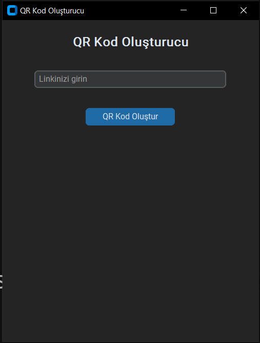
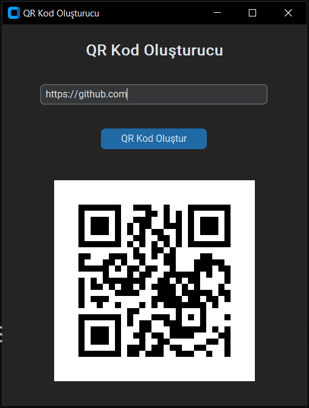

# QR Kod Oluşturucu Uygulaması

Bu Python masaüstü uygulaması, kullanıcıdan alınan bir bağlantıyı QR koduna dönüştürerek, oluşturulan QR kodunu bir resim olarak kaydeder ve ekranda gösterir. Kullanıcı arayüzü, modern bir görünüm sağlayan `CustomTkinter` ile oluşturulmuştur.

## Özellikler
- **QR Kod Oluşturma**: Girilen bağlantıya göre QR kodunu oluşturur.
- **QR Kodu Gösterme**: Oluşturulan QR kodu ekranda görüntülenir.
- **QR Kodu Kaydetme**: QR kodu `qrcode.png` olarak kaydedilir.
- **Koyu Tema**: Koyu renkli bir tema ile modern bir arayüz sağlar.

## Ekran Görüntüleri

